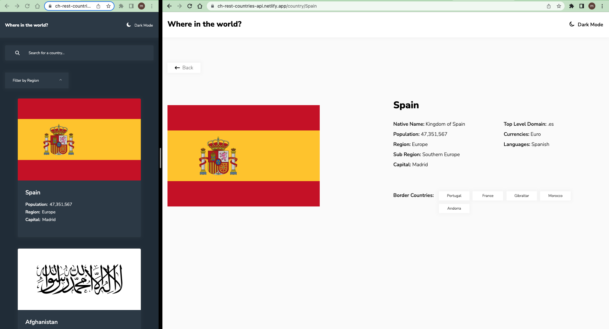

# Frontend Mentor - REST Countries API with color theme switcher solution

This is a solution to the [REST Countries API with color theme switcher challenge on Frontend Mentor](https://www.frontendmentor.io/challenges/rest-countries-api-with-color-theme-switcher-5cacc469fec04111f7b848ca).

## Table of contents

- [Overview](#overview)
  - [The challenge](#the-challenge)
  - [Screenshot](#screenshot)
  - [Links](#links)
- [My process](#my-process)
  - [Built with](#built-with)
  - [What I learned](#what-i-learned)
  - [Continued development](#continued-development)
  - [Useful resources](#useful-resources)
- [Author](#author)
- [Acknowledgments](#acknowledgments)

## Overview

### The challenge

Users should be able to:

- See all countries from the API on the homepage
- Search for a country using an `input` field
- Filter countries by region
- Click on a country to see more detailed information on a separate page
- Click through to the border countries on the detail page
- Toggle the color scheme between light and dark mode *(optional)*

### Screenshot

### Links

- Solution: [frontendmentor.io](https://www.frontendmentor.io/solutions/rest-countries-api-fZYpAQrf03)

- Live Site: [netlify.app](https://ch-rest-countries-api.netlify.app)

## My process

- Preparing workflow(Installing React, Adding assets, Preparing README.md)
- Creating Components
- Working on mobile design based on `design` folder - 357px
  - Installing Fonts, Preflight css, Working on design
- Working on tablet and desktop design based on `design` folder
- Working on functionality
  - Load data, Search, Filter using react-router-dom
  - Toggle between dark and light mode

### Built with

- React
- React Router
- Css Module
- Flex, Grid, Custom variable
- Semantic HTML5 markup
- Mobile first workflow

### What I learned

In this project I learned to use React Router (loader and action)

### Continued development

More on React, React Router, Framer-Motion and some other libraries

### Useful resources

[React Router](https://reactrouter.com)

## Author

- github - [@siavhnz](https://www.github.com/siavhnz)

- Frontend Mentor - [@siavhnz](https://www.frontendmentor.io/profile/siavhnz)

## Acknowledgments

Thanks To

[Frontendmentor.io](https://www.frontendmentor.io/challenges) - for their Excitement challenges  

[Perfect Pixel](https://chrome.google.com/webstore/detail/perfectpixel-by-welldonec/dkaagdgjmgdmbnecmcefdhjekcoceebi?hl=en) - for such a great extension
